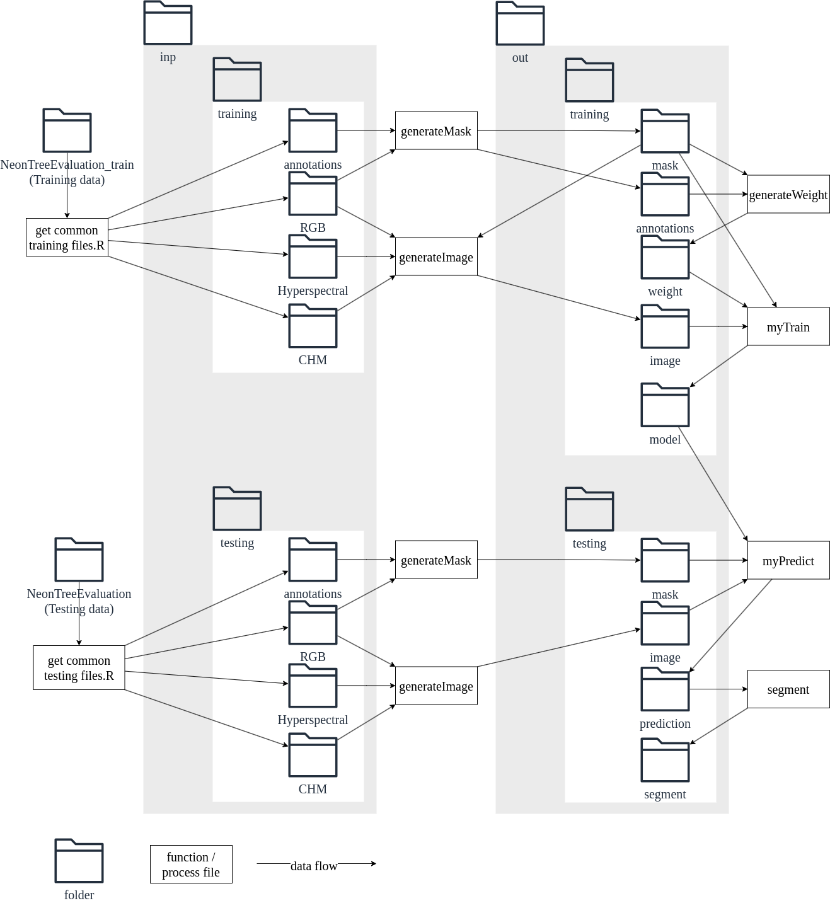

# How to reproduce
## 1. [install micromamba](https://mamba.readthedocs.io/en/latest/installation/micromamba-installation.html)
For Linux, macOS, or Git Bash on Windows, install with:
"${SHELL}" <(curl -L micro.mamba.pm/install.sh)

Default settings during the installation was fine for me.

## 2. create environment
micromamba create -n Chen2024

micromamba install -n Chen2024 -c conda-forge r-keras r-terra r-rsample tensorflow-gpu "keras<3" cuda=12.2 cudnn r-devtools r-sf r-lidr r-ggrepel

## 3. install NeonTreeEvaluation in R
micromamba activate Chen2024

R

devtools::install_github("Weecology/NeonTreeEvaluation_package", ref="c4d9953")

3 # do not update any package

quit()

n

micromamba deactivate

## 4. put function.R file in the right place
put function.R under ~/Chen2024/IPO/pro, which is the place it should be in for compatibility with the scripts. Otherwise, change paths accordingly in the scripts.

## 5. run the scripts with the created environment

# Dataflow
The following figure provides an overview of the main folder structure, functions, and flow of data in this study.

# Licence
This repository is licensed under the GNU General Public License, Version 3, or any later version.

In function.R, the function `unet` contained modification and the function `conv2d_block` contained copy from [r-tensorflow/unet]( https://github.com/r-tensorflow/unet/blob/c47cf31f13050722b587a5c394d4511d8f5e50b9/R/model.R) under the MIT License.

In function.R, the function `unet` contained modification from [keras-team/keras]( https://github.com/keras-team/keras/blob/r2.15/keras/backend.py#L5802) under the Apache License, Version 2.0.
